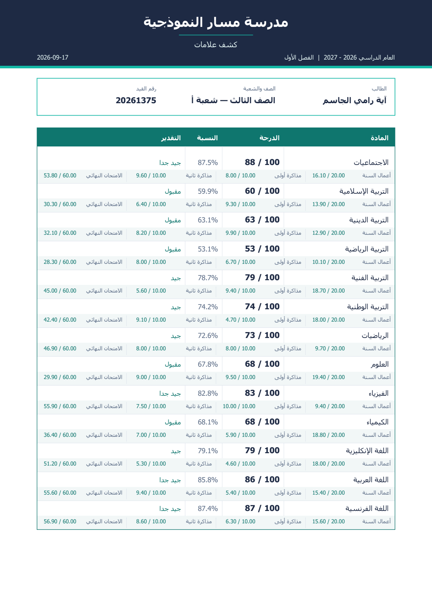
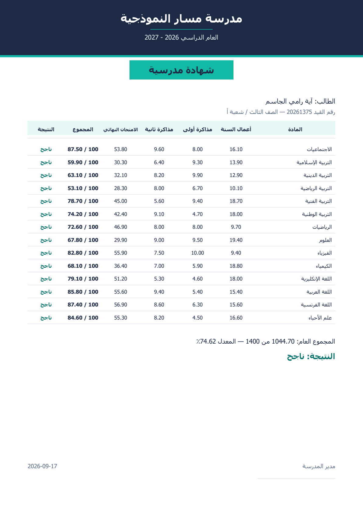
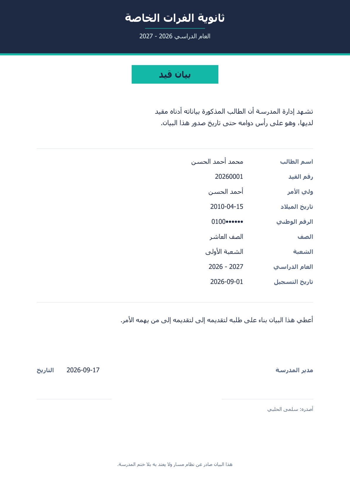
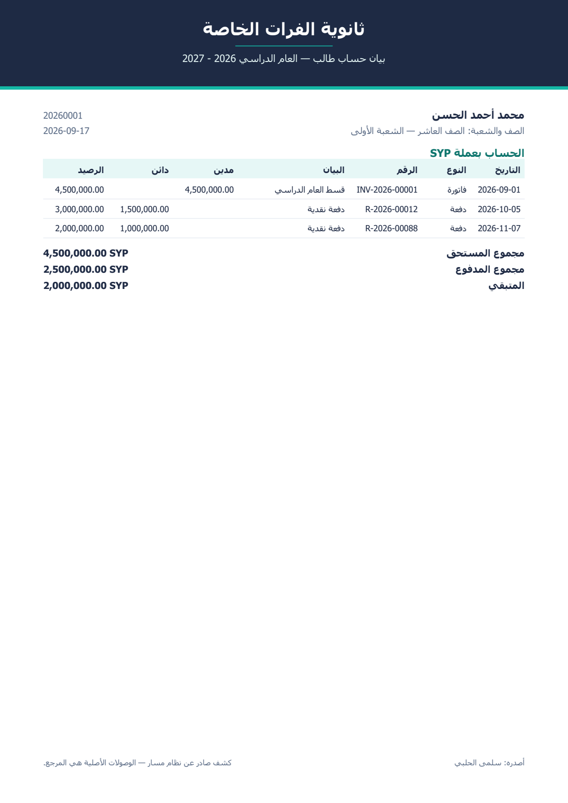
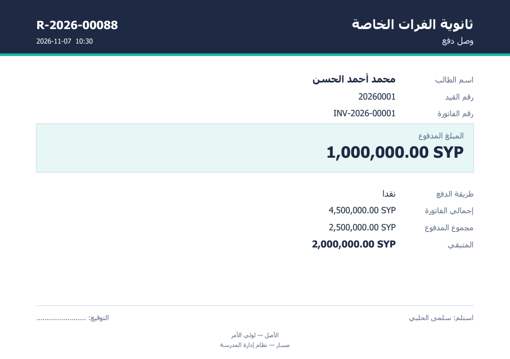
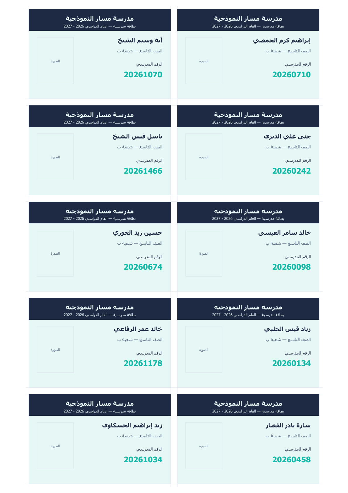

<div align="center">

# مَسار · Masar

**نظام إدارة مدرسة يعمل بلا إنترنت — للمدارس السورية**

*An offline-first school management system for Syrian schools*

</div>

---

## ما هو

برنامج سطح مكتب يدير مدرسة كاملة: الطلاب والشُّعب والعلامات والحضور
والمالية والرواتب — **بلا إنترنت، وبلا اشتراك شهري، وبلا خادم خارجي**.
يعمل على شبكة المدرسة المحلّية وحدها.

بُني لواقع محدّد: مدارس تعمل بانقطاع كهرباء متكرّر، وبإنترنت غير
مضمون، وبميزانية لا تحتمل اشتراكاً بالدولار كل شهر. كل شيء داخل
الحزمة — قاعدة البيانات والخادم والواجهة.

> هذا مستودع **عرضٍ** لا مستودع كود. البرنامج منتج تجاري يُباع
> للمدارس، والشيفرة المصدرية ليست هنا.

---

## لمحة عن المخرجات

كل الوثائق تُولَّد بالعربية مع تشكيل الحروف واتجاه النصّ الصحيح
(`arabic-reshaper` + `python-bidi`)، وتُطبع على ورق A4 وA5 مباشرةً.

### كشف العلامات

علامة كل مادة مفصَّلةً إلى مكوّناتها — «أعمال السنة ١٨ من ٢٠، المذاكرة
الأولى ١٩٫٥ من ٢٠» — لا نسبةً مئوية مجرّدة، لأن هذا ما يفهمه وليّ الأمر.



### شهادة نهاية العام

 

**يميناً:** الشهادة السنوية بأعمدة المكوّنات والنتيجة (ناجح / مكمّل /
راسب — وفق عُرف المدرسة السورية: مادة أو مادتان إكمال لا رسوب).
**يساراً:** بيان القيد.

### المالية

 

بيان حساب الطالب بعملات متعدّدة برصيد جارٍ، ووصل الدفع بنسختين —
الأصل للأهل وصورة تبقى في المدرسة.

### البطاقات المدرسية



بمقاس بطاقة الهوية، عشر بطاقات في ورقة A4 بعلامات قصّ، والظهر مطبوع
معكوساً للطباعة على الوجهين.

---

## البنية

```
┌──────────────────────────────────────────────────────┐
│  أجهزة الموظفين — Flutter/Dart على ويندوز            │
│  تثبيت بصمة الشهادة (certificate pinning)            │
└───────────────────────┬──────────────────────────────┘
                        │  HTTPS · شبكة المدرسة وحدها
┌───────────────────────┴──────────────────────────────┐
│  جهاز الخادم                                          │
│  ├── FastAPI · Python 3.13 · SQLAlchemy 2.0 async    │
│  ├── PostgreSQL 16 محمولة (داخل الحزمة)              │
│  └── ReportLab · توليد الوثائق العربية                │
└──────────────────────────────────────────────────────┘
```

| الطبقة | التقنية |
|---|---|
| الواجهة | Flutter 3.44 · Riverpod · Dio |
| الخادم | FastAPI · Pydantic v2 · asyncpg |
| القاعدة | PostgreSQL 16 — محمولة، لا تُثبَّت |
| الوثائق | ReportLab + arabic-reshaper + python-bidi |
| التوزيع | Inno Setup — حزمة واحدة ٥٩ م.ب |

---

## قرارات هندسية

**القاعدة تحرس نفسها.** المنطق الحرج في القاعدة لا في التطبيق: مشغّل
يمنع الدفع الزائد على الفاتورة ويشتقّ حالتها، وقيود استبعاد تمنع تعارض
عقود الرواتب، ومفاتيح أجنبية مركّبة تمنع رصد علامة لطالب من شعبة أخرى.
خطأٌ في طبقة التطبيق لا يفسد البيانات.

**سجلّ تدقيق مقفل.** كل تغيير يُسجَّل في سلسلة مرتبطة بالتجزئة
(hash chain)، ومشغّل يرفض `UPDATE` و`DELETE` حتى من مالك القاعدة.
دالّة تحقّق تكشف أي قطع في السلسلة وتسمّي السطر.

**أربعة أدوار لا واحد، ولا أحدها superuser.** التطبيق يتّصل بدور
بلا صلاحيات DDL، والترقيات بدورٍ آخر يُفتح لحظةً عند الإقلاع ويُغلق.

**الصلاحيات تُفحص بالملكية لا بالدور.** لا نقطة نهاية تحمل معرّف كائن
بلا فحص ملكية — ويوجد فحص برمجي يفشل البناء إن ظهرت واحدة.

**لا غرامات تأخير.** قرارٌ صريح مفروضٌ باختبار يتأكّد أن لا عمود غرامة
في أي جدول. النظام يعرض من تأخّر ولا يضيف على أحد مبلغاً.

**العربية ليست ترجمةً.** الاتجاه والتشكيل ومحاذاة الأرقام واللّيرة
السورية والتقويم — كلها في صميم التصميم لا طبقة فوقه.

---

## الأرقام

| | |
|---|---|
| اختبار خادم | **٩٣٦** |
| اختبار واجهة | **٣١١** |
| اختبارات SQL سلوكية | تمرّ كلها |
| اختبارات الامتياز الأدنى | ٧ / ٧ |
| محاولة اختراق مُوجَّهة | **٣٤ — صُدّت كلها** |
| نقاط النهاية في الفحص الشامل | ١٧٤ استجابة، صفر انهيار |
| نتائج تدقيق موثَّقة ومُصلَحة | **أكثر من ١٠٠** |

---

## طريقة العمل

كل عطل يُردّ إلى سببه في الكود قبل إصلاحه، ويُوثَّق بمعرّف
(`SEC-nn`, `DB-nn`, `UX-nn`, `ACAD-nn`, `FIN-nn`, `OPS-nn`)
مع **ما كان يحدث فعلاً** لا وصفاً عاماً.

أمثلة من السجلّ:

> **UX-33** — عرض خانة المكوّن كان يُسنَد إلى `width`، والاسم مأخوذ
> لعرض الصفحة في الدالّة نفسها. فصار تذييل كل كشفٍ لمادةٍ لها مكوّنات
> يُرسم على ٤٤ مم بدل ٢١٠: «المدير» و«المرشد» فوق بعضهما في زاوية
> الورقة. مرّ على ٩٠٧ اختبارات لأنها تفحص أن الـPDF يُولَّد لا **أين**
> رُسم فيه كل شيء.

> **FIN-08** — شاشة المتأخرات تعرض صفراً والمدرسة فيها ٥٧٠ فاتورة لم
> تُسدَّد: العرض يقرأ جدول الأقساط، وفاتورةٌ بلا خطة تقسيط لا قسط لها —
> فالطالب الذي لم يدفع شيئاً أصلاً هو أبعد ما يكون عن «المتأخرين» في
> نظر النظام.

> **ACAD-31** — الغياب يُسجَّل ثم يختفي من كشف العلامات. الحضور يُكتب
> على تقويم اليوم، والكشف يُقرأ من فصل السنة «الجارية» — ومدرسةٌ جعلت
> سنةً لم تبدأ بعد هي الجارية. فافترقت الشاشتان بصمت.

📄 [**سجلّ النتائج الكامل**](docs/engineering-log.md) · [**جولات المراجعة**](docs/review-rounds.md)

---

## الحالة

يعمل في مدرسة حقيقية. الإصدار الحالي **2.4.0**.

---

## الترخيص

© محمد — كل الحقوق محفوظة. هذا المستودع للعرض؛ لا إذن بالنسخ أو
الاشتقاق أو الاستعمال التجاري. للاستفسار عن البرنامج، تواصل معي.
